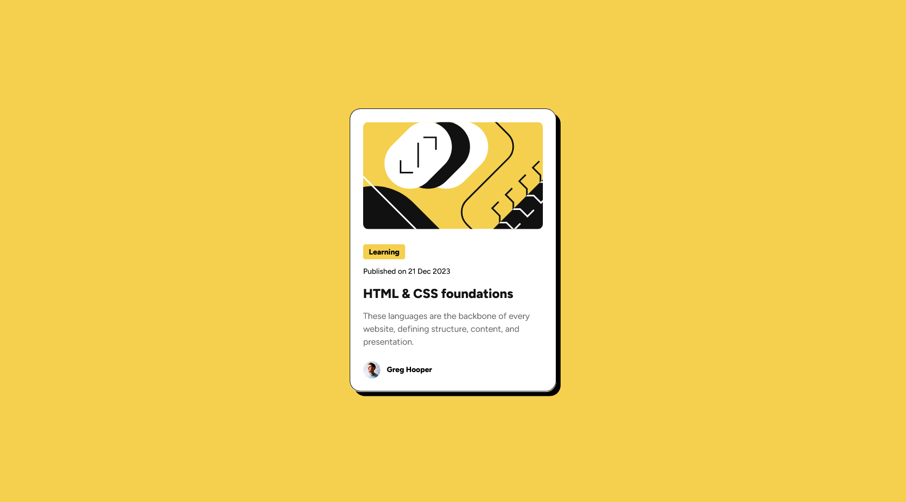

# Frontend Mentor - Blog preview card solution

This is a solution to the [Blog preview card challenge on Frontend Mentor](https://www.frontendmentor.io/challenges/blog-preview-card-ckPaj01IcS). Frontend Mentor challenges help you improve your coding skills by building realistic projects. 

## Table of contents

- [Overview](#overview)
  - [The challenge](#the-challenge)
  - [Screenshot](#screenshot)
  - [Links](#links)
- [My process](#my-process)
  - [Built with](#built-with)
  - [What I learned](#what-i-learned)
  - [Continued development](#continued-development)
  - [Useful resources](#useful-resources)
- [Author](#author)
- [Acknowledgments](#acknowledgments)


## Overview

### The challenge

Users should be able to:

- See hover and focus states for all interactive elements on the page

### Screenshot



### Links

- Solution URL: [Add solution URL here](https://your-solution-url.com)
- Live Site URL: [Add live site URL here](https://your-live-site-url.com)

## My process

### Built with

- Semantic HTML5 markup
- CSS custom properties
- Flexbox
- Mobile-first workflow


### What I learned

This was an interesting build. What I learnt majorly was using accessibility best practice like Aria and responsive tactics especially in my typography. There was temptation to just use media queries, but instead I used the "clamp function".

ARIA, which stands for Accessible Rich Internet Applications, is a set of attributes you can add to HTML elements to make web content and applications more accessible to people with disabilities.

The clamp function takes three arguements. First the min value, Second, the view port percentage and the max value. With this, the unit is able to adjust depending on the view port width. Examples of ARIA and clamp are below

To see how you can add code snippets, see below:

```html
<div class="card__content" role="article" aria-labelledby="card-title"
          >... 
            <h1 class="card__heading" id="card-title">
              <span class="card__heading-span">html & css</span> foundations
            </h1>
</div>
```
```css
.card__paragraph {
  font-size: clamp(14px, 0.18779vw + 13.29577px, 16px);
}
```

### Continued development

I would love to explore in-depth how to use the clamp function, min-function to write more responsive code to better improve efficiency.

The Aria attributes can be a lot 😅 and I would love to know when it is essential to apply them, and when they are redundant.

### Useful resources

- [USING CLAMP FUNCTIONS](https://www.w3schools.com/cssref/func_clamp.php) - This would help in understanding the basics and how clamp functions work. I particularly learnt and practiced using AI.
- [AN OVERVIEW ON ARIA](https://www.w3.org/WAI/ARIA/apg/) - The W3C gives great resource in web accessibility, and would give clarity in understanding ARIA and what they hope to achieve.

## Author

- Website - [Temidayo David](https://www.linkedin.com/in/temidayodavid)
- Frontend Mentor - [@TemidayoDavid](https://www.frontendmentor.io/profile/TemidayoDavid)
- LinkedIn - [@yourusername](https://www.linkedin.com/in/temidayodavid)

## Acknowledgments

Kevin Powell is a remarkable teacher and his course on responsive layouts really is valuable. Through it, knowledge of functions like min, clamp and the aria accessibility was remembered. Thank you Kevin.

